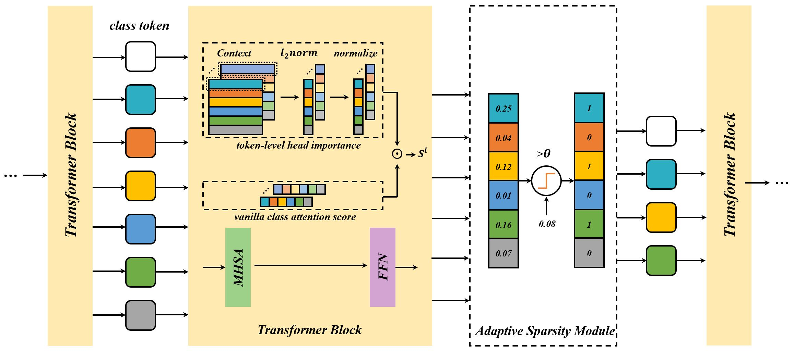
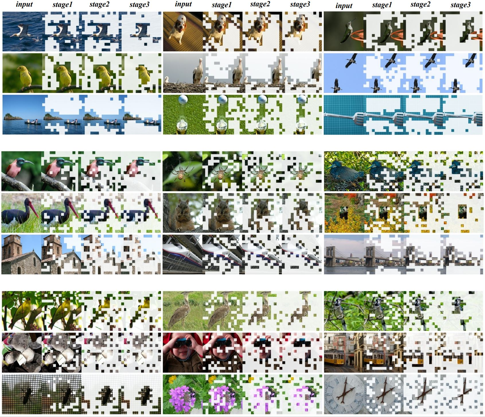

# AS-ViT

Implement of [Adaptive Sparse ViT](https://arxiv.org/abs/2209.13802)





## requirement

torch==1.9.0  
torchvision==0.10.1  
timm==0.4.12

## training

```sh finetune.sh```

## inference

```python3 infer.py --model-path path_to_model.pth --batch-size 256 --arch deit_small --data-path path_to_imagenet```